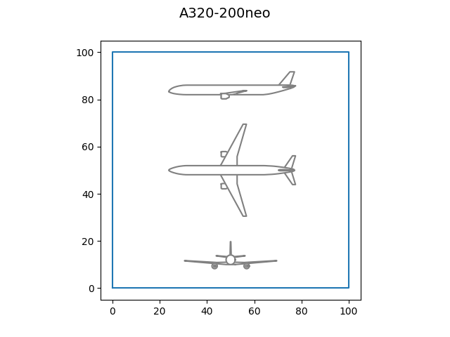
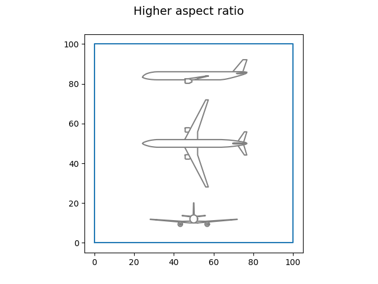
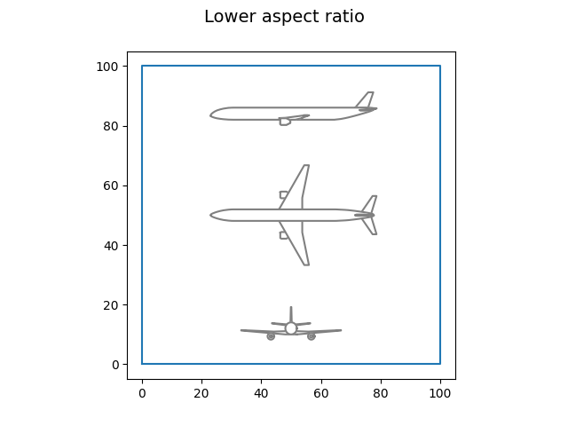

<!--
 DO NOT EDIT.
 THIS FILE WAS AUTOMATICALLY GENERATED BY mkdocs-gallery.
 TO MAKE CHANGES, EDIT THE SOURCE PYTHON FILE:
 "docs/scripts/examples/plot_draw_aicraft.py"
 LINE NUMBERS ARE GIVEN BELOW.
-->

!!! note

    Click [here](#download_links)
    to download the full example code

# Draw an aircraft

<!-- GENERATED FROM PYTHON SOURCE LINES 2-5 -->

```{.python }

from lh2pac.gemseo.utils import draw_aircraft

```


<!-- GENERATED FROM PYTHON SOURCE LINES 6-8 -->

First,
we draw the default aircraft:

<!-- GENERATED FROM PYTHON SOURCE LINES 8-10 -->

```{.python }
draw_aircraft()

```


{: .mkd-glr-single-img srcset="../images/mkd_glr_plot_draw_aicraft_001.png"}

Out:
{: .mkd-glr-script-out }

```{.shell .mkd-glr-script-out-disp }
/home/mickael/ModIA_5A/Metamodelisation/lh2pac/src/lh2pac/marilib/aircraft/tool/drawing.py:287: UserWarning: FigureCanvasAgg is non-interactive, and thus cannot be shown
  plt.show()

```


<!-- GENERATED FROM PYTHON SOURCE LINES 11-13 -->

Then,
we draw an aircraft with a higher aspect ratio:

<!-- GENERATED FROM PYTHON SOURCE LINES 13-15 -->

```{.python }
draw_aircraft({"aspect_ratio": 12}, "Higher aspect ratio")

```


{: .mkd-glr-single-img srcset="../images/mkd_glr_plot_draw_aicraft_002.png"}

Out:
{: .mkd-glr-script-out }

```{.shell .mkd-glr-script-out-disp }
/home/mickael/ModIA_5A/Metamodelisation/lh2pac/src/lh2pac/marilib/aircraft/tool/drawing.py:287: UserWarning: FigureCanvasAgg is non-interactive, and thus cannot be shown
  plt.show()

```


<!-- GENERATED FROM PYTHON SOURCE LINES 16-18 -->

Lastly,
we draw an aircraft with a lower aspect ratio:

<!-- GENERATED FROM PYTHON SOURCE LINES 18-19 -->

```{.python }
draw_aircraft({"aspect_ratio": 7}, "Lower aspect ratio")
```


{: .mkd-glr-single-img srcset="../images/mkd_glr_plot_draw_aicraft_003.png"}

Out:
{: .mkd-glr-script-out }

```{.shell .mkd-glr-script-out-disp }
/home/mickael/ModIA_5A/Metamodelisation/lh2pac/src/lh2pac/marilib/aircraft/tool/drawing.py:287: UserWarning: FigureCanvasAgg is non-interactive, and thus cannot be shown
  plt.show()

```


**Total running time of the script:** ( 0 minutes  5.538 seconds)

<div id="download_links"></div>


[:fontawesome-solid-download: Download Python source code: plot_draw_aicraft.py](./plot_draw_aicraft.py){ .md-button .center}

[:fontawesome-solid-download: Download Jupyter notebook: plot_draw_aicraft.ipynb](./plot_draw_aicraft.ipynb){ .md-button .center}


[Gallery generated by mkdocs-gallery](https://mkdocs-gallery.github.io){: .mkd-glr-signature }
