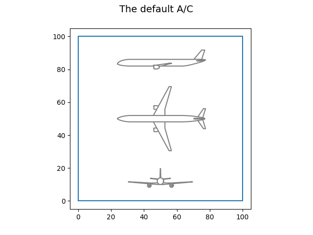
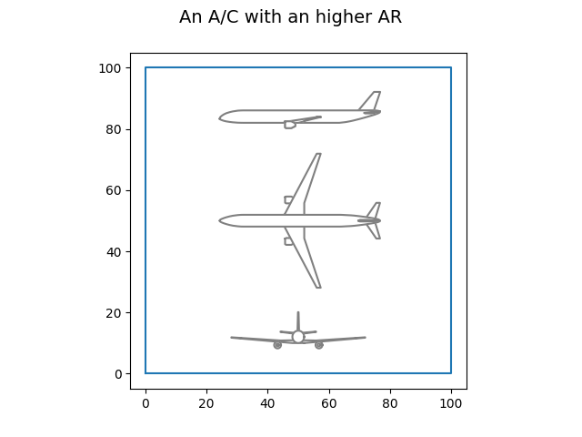

<!--
 DO NOT EDIT.
 THIS FILE WAS AUTOMATICALLY GENERATED BY mkdocs-gallery.
 TO MAKE CHANGES, EDIT THE SOURCE PYTHON FILE:
 "docs/scripts/examples/plot_h2turbo_fan.py"
 LINE NUMBERS ARE GIVEN BELOW.
-->

!!! note

    Click [here](#download_links)
    to download the full example code

# The H2TurboFan discipline

<!-- GENERATED FROM PYTHON SOURCE LINES 2-9 -->

```{.python }

from numpy import array

from lh2pac.gemseo.discipline import H2TurboFan
from lh2pac.gemseo.utils import draw_aircraft
from lh2pac.gemseo.utils import get_aircraft_data

```


<!-- GENERATED FROM PYTHON SOURCE LINES 10-11 -->

First, we instantiate the discipline:

<!-- GENERATED FROM PYTHON SOURCE LINES 11-13 -->

```{.python }
discipline = H2TurboFan()

```


<!-- GENERATED FROM PYTHON SOURCE LINES 14-16 -->

Then,
we can have a look at its input names:

<!-- GENERATED FROM PYTHON SOURCE LINES 16-18 -->

```{.python }
discipline.get_input_data_names()

```


Out:
{: .mkd-glr-script-out }

```{.shell .mkd-glr-script-out-disp }

['thrust', 'bpr', 'area', 'aspect_ratio', 'tgi', 'tvi', 'sfc', 'mass', 'drag']
```


<!-- GENERATED FROM PYTHON SOURCE LINES 19-20 -->

output names:

<!-- GENERATED FROM PYTHON SOURCE LINES 20-22 -->

```{.python }
discipline.get_output_data_names()

```


Out:
{: .mkd-glr-script-out }

```{.shell .mkd-glr-script-out-disp }

['mtow', 'tofl', 'vapp', 'vz_mcl', 'vz_mcr', 'oei_path', 'ttc', 'far', 'fuel', 'coc']
```


<!-- GENERATED FROM PYTHON SOURCE LINES 23-24 -->

and default input values:

<!-- GENERATED FROM PYTHON SOURCE LINES 24-26 -->

```{.python }
discipline.default_inputs

```


Out:
{: .mkd-glr-script-out }

```{.shell .mkd-glr-script-out-disp }

{'area': array([160.]), 'aspect_ratio': array([9.5]), 'thrust': array([125000.]), 'bpr': array([8.5]), 'drag': array([1.]), 'tgi': array([0.3]), 'tvi': array([0.845]), 'sfc': array([1.]), 'mass': array([1.])}
```


<!-- GENERATED FROM PYTHON SOURCE LINES 27-28 -->

and execute the discipline with these values:

<!-- GENERATED FROM PYTHON SOURCE LINES 28-30 -->

```{.python }
discipline.execute()

```


Out:
{: .mkd-glr-script-out }

```{.shell .mkd-glr-script-out-disp }

{'area': array([160.]), 'aspect_ratio': array([9.5]), 'thrust': array([125000.]), 'bpr': array([8.5]), 'drag': array([1.]), 'tgi': array([0.3]), 'tvi': array([0.845]), 'sfc': array([1.]), 'mass': array([1.]), 'vapp': array([70.64663708]), 'mtow': array([84264.87197867]), 'coc': array([5790.24820306]), 'vz_mcr': array([1.11425584]), 'far': array([13.14324743]), 'fuel': array([994.73460336]), 'vz_mcl': array([5.53241387]), 'oei_path': array([0.01700101]), 'tofl': array([2144.18746791]), 'ttc': array([1094.19026816])}
```


<!-- GENERATED FROM PYTHON SOURCE LINES 31-32 -->

We can print the aircraft data:

<!-- GENERATED FROM PYTHON SOURCE LINES 32-35 -->

```{.python }
aircraft_data = get_aircraft_data(discipline)
print(aircraft_data)

```


Out:
{: .mkd-glr-script-out }

```{.shell .mkd-glr-script-out-disp }
---------------------------------------------------------------------------
Drag factor =    1.000 (0.99 =< kcx =< 1.03)
SFC factor =    1.000 (0.99 =< ksfc =< 1.03)
Mass factor =    1.000 (0.99 =< kmass =< 1.03)
Tank Volumetric Index =    0.845 m3-LH2 / m3-(LH2+Tank), (0.6 =< vi =< 0.85)
Tank Gravimetric Index =    0.300 kg-LH2 / kg-(LH2+Tank), (0.25 =< gi =< 0.305)

Reference thrust =    125.0 kN, (100 =< thrust =< 150)
By Pass Ratio =      8.5 (5 =< bpr =< 12)
Reference area =    160.0 m2, (120 =< area =< 200)
Aspect ratio =      9.5 (7 =< ar =< 12)
---------------------------------------------------------------------------
Criterion, Max Take Off Weight =  84264.9 kg
Criterion, Cost mission fuel block =    994.7 kg
Criterion, Cash Operating Cost =   5790.2 $/trip

Constraint, Take Off Field Length =   2144.2 m (must be =< 2200 m)
Constraint, Approach speed =    137.3 kt (must be =< 137 kt)
Constraint, Vertical speed, MCL rating, TOC =   1089.1 ft/min (must be >= 300 ft/min)
Constraint, Vertical speed, MCR rating, TOC =    219.3 ft/min (must be >= 0 ft/min)
Constraint, One Engine Inoperative climb path =     1.70 % (must be >= 1.1%)
Constraint, Time To Climb =     18.2 min (must be =< 25 min)
Constraint, fuselage aspect ratio =   13.143 (must be =< 13.4)

```


<!-- GENERATED FROM PYTHON SOURCE LINES 36-37 -->

and draw the aircraft:

<!-- GENERATED FROM PYTHON SOURCE LINES 37-39 -->

```{.python }
draw_aircraft(discipline, "The default A/C")

```


{: .mkd-glr-single-img srcset="../images/mkd_glr_plot_h2turbo_fan_001.png"}

Out:
{: .mkd-glr-script-out }

```{.shell .mkd-glr-script-out-disp }
/home/mickael/ModIA_5A/Metamodelisation/lh2pac/src/lh2pac/marilib/aircraft/tool/drawing.py:287: UserWarning: FigureCanvasAgg is non-interactive, and thus cannot be shown
  plt.show()

```


<!-- GENERATED FROM PYTHON SOURCE LINES 40-42 -->

Lastly,
we can execute the discipline with a higher aspect ratio:

<!-- GENERATED FROM PYTHON SOURCE LINES 42-44 -->

```{.python }
discipline.execute({"aspect_ratio": array([12])})

```


Out:
{: .mkd-glr-script-out }

```{.shell .mkd-glr-script-out-disp }

{'thrust': array([125000.]), 'bpr': array([8.5]), 'area': array([160.]), 'aspect_ratio': array([12]), 'tgi': array([0.3]), 'tvi': array([0.845]), 'sfc': array([1.]), 'mass': array([1.]), 'drag': array([1.]), 'vapp': array([70.64457577]), 'mtow': array([83953.10807835]), 'coc': array([5787.04862876]), 'vz_mcr': array([2.02629216]), 'far': array([12.96364774]), 'fuel': array([943.30955561]), 'vz_mcl': array([6.20068054]), 'oei_path': array([0.02229883]), 'tofl': array([2130.16395761]), 'ttc': array([1014.59863128])}
```


<!-- GENERATED FROM PYTHON SOURCE LINES 45-46 -->

print the aircraft data:

<!-- GENERATED FROM PYTHON SOURCE LINES 46-49 -->

```{.python }
aircraft_data = get_aircraft_data(discipline)
print(aircraft_data)

```


Out:
{: .mkd-glr-script-out }

```{.shell .mkd-glr-script-out-disp }
---------------------------------------------------------------------------
Drag factor =    1.000 (0.99 =< kcx =< 1.03)
SFC factor =    1.000 (0.99 =< ksfc =< 1.03)
Mass factor =    1.000 (0.99 =< kmass =< 1.03)
Tank Volumetric Index =    0.845 m3-LH2 / m3-(LH2+Tank), (0.6 =< vi =< 0.85)
Tank Gravimetric Index =    0.300 kg-LH2 / kg-(LH2+Tank), (0.25 =< gi =< 0.305)

Reference thrust =    125.0 kN, (100 =< thrust =< 150)
By Pass Ratio =      8.5 (5 =< bpr =< 12)
Reference area =    160.0 m2, (120 =< area =< 200)
Aspect ratio =     12.0 (7 =< ar =< 12)
---------------------------------------------------------------------------
Criterion, Max Take Off Weight =  83953.1 kg
Criterion, Cost mission fuel block =    943.3 kg
Criterion, Cash Operating Cost =   5787.0 $/trip

Constraint, Take Off Field Length =   2130.2 m (must be =< 2200 m)
Constraint, Approach speed =    137.3 kt (must be =< 137 kt)
Constraint, Vertical speed, MCL rating, TOC =   1220.6 ft/min (must be >= 300 ft/min)
Constraint, Vertical speed, MCR rating, TOC =    398.9 ft/min (must be >= 0 ft/min)
Constraint, One Engine Inoperative climb path =     2.23 % (must be >= 1.1%)
Constraint, Time To Climb =     16.9 min (must be =< 25 min)
Constraint, fuselage aspect ratio =   12.964 (must be =< 13.4)

```


<!-- GENERATED FROM PYTHON SOURCE LINES 50-51 -->

and draw the aircraft:

<!-- GENERATED FROM PYTHON SOURCE LINES 51-52 -->

```{.python }
draw_aircraft(discipline, "An A/C with an higher AR")
```


{: .mkd-glr-single-img srcset="../images/mkd_glr_plot_h2turbo_fan_002.png"}

Out:
{: .mkd-glr-script-out }

```{.shell .mkd-glr-script-out-disp }
/home/mickael/ModIA_5A/Metamodelisation/lh2pac/src/lh2pac/marilib/aircraft/tool/drawing.py:287: UserWarning: FigureCanvasAgg is non-interactive, and thus cannot be shown
  plt.show()

```


**Total running time of the script:** ( 0 minutes  4.029 seconds)

<div id="download_links"></div>


[:fontawesome-solid-download: Download Python source code: plot_h2turbo_fan.py](./plot_h2turbo_fan.py){ .md-button .center}

[:fontawesome-solid-download: Download Jupyter notebook: plot_h2turbo_fan.ipynb](./plot_h2turbo_fan.ipynb){ .md-button .center}


[Gallery generated by mkdocs-gallery](https://mkdocs-gallery.github.io){: .mkd-glr-signature }
