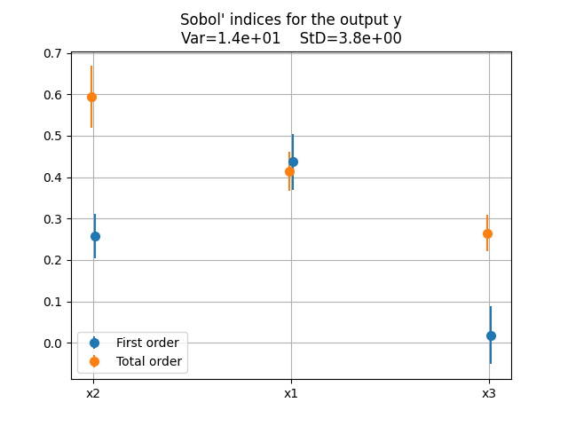

<!--
 DO NOT EDIT.
 THIS FILE WAS AUTOMATICALLY GENERATED BY mkdocs-gallery.
 TO MAKE CHANGES, EDIT THE SOURCE PYTHON FILE:
 "docs/scripts/examples/plot_sensitivity_analysis.py"
 LINE NUMBERS ARE GIVEN BELOW.
-->

!!! note

    Click [here](#download_links)
    to download the full example code


# Sensitivity analysis

In this example,
we will use the Sobol' analysis to quantify
the sensitivity of the output of the Ishigami function to its inputs:

$$f(x_1,x_2,x_3)=\sin(x_1)+7\sin(x_2)^2+0.1*x_3^4\sin(x_1)$$

where $x_1,x_2,x_3\in[-\pi,\pi]$.

<!-- GENERATED FROM PYTHON SOURCE LINES 12-20 -->

```{.python }

import pprint

from gemseo.algos.parameter_space import ParameterSpace
from gemseo import create_discipline
from gemseo.uncertainty.sensitivity.sobol.analysis import SobolAnalysis
from numpy import pi

```


<!-- GENERATED FROM PYTHON SOURCE LINES 21-23 -->

Firstly,
we create the Ishigami function:

<!-- GENERATED FROM PYTHON SOURCE LINES 23-29 -->

```{.python }
discipline = create_discipline(
    "AnalyticDiscipline",
    expressions={"y": "sin(x2)+7*sin(x1)**2+0.1*x3**4*sin(x2)"},
    name="Ishigami",
)

```


<!-- GENERATED FROM PYTHON SOURCE LINES 30-32 -->

Then,
we define the uncertain space with uniform distributions:

<!-- GENERATED FROM PYTHON SOURCE LINES 32-38 -->

```{.python }
uncertain_space = ParameterSpace()
for name in ["x1", "x2", "x3"]:
    uncertain_space.add_random_variable(
        name, "OTUniformDistribution", minimum=-pi, maximum=pi
    )

```


<!-- GENERATED FROM PYTHON SOURCE LINES 39-56 -->

From that,
we launch a Sobol' analysis with a maximum of 10000 samples:

!!! warning

    The estimation of Sobol' indices relies on the pick-and-freeze (PF) DOE algorithm
    and most of the UQ libraries generates $(1+p)N$ evaluations
    where $p$ is the dimension of the input space
    and $N$ is presented as *the number of samples*.
    In fact,
    $N$ is not the number of samples of the simulators
    but the number of samples in the sense of the PF-based estimators,
    which is misleading.
    This is reason why GEMSEO considers a maximum number of samples $n$,
    *i.e* a maximum number of simulations,
    and then $N$ is deduced from this number: $N=\lceil n/(1+p)\rceil$.


<!-- GENERATED FROM PYTHON SOURCE LINES 56-59 -->

```{.python }
sobol = SobolAnalysis([discipline], uncertain_space, 10000)
sobol.compute_indices()

```


Out:
{: .mkd-glr-script-out }

```{.shell .mkd-glr-script-out-disp }
/home/mickael/ModIA_5A/Metamodelisation/lh2pac/.venv/lib/python3.9/site-packages/pandas/core/frame.py:706: DeprecationWarning: Passing a BlockManager to IODataset is deprecated and will raise in a future version. Use public APIs instead.
  warnings.warn(
/home/mickael/ModIA_5A/Metamodelisation/lh2pac/.venv/lib/python3.9/site-packages/pandas/core/frame.py:706: DeprecationWarning: Passing a BlockManager to IODataset is deprecated and will raise in a future version. Use public APIs instead.
  warnings.warn(
/home/mickael/ModIA_5A/Metamodelisation/lh2pac/.venv/lib/python3.9/site-packages/pandas/core/frame.py:706: DeprecationWarning: Passing a BlockManager to IODataset is deprecated and will raise in a future version. Use public APIs instead.
  warnings.warn(

{<Method.FIRST: 'first'>: {'y': [{'x1': array([0.43704383]), 'x2': array([0.25794631]), 'x3': array([0.01847323])}]}, 'second': {'y': [{'x1': {'x1': array([[0.]]), 'x2': array([[-0.03347684]]), 'x3': array([[-0.02292812]])}, 'x2': {'x1': array([[-0.03347684]]), 'x2': array([[0.]]), 'x3': array([[0.25936497]])}, 'x3': {'x1': array([[-0.02292812]]), 'x2': array([[0.25936497]]), 'x3': array([[0.]])}}]}, <Method.TOTAL: 'total'>: {'y': [{'x1': array([0.41479788]), 'x2': array([0.59310361]), 'x3': array([0.26454354])}]}}
```


<!-- GENERATED FROM PYTHON SOURCE LINES 60-61 -->

and print the results:

<!-- GENERATED FROM PYTHON SOURCE LINES 61-64 -->

```{.python }
pprint.pprint(sobol.first_order_indices)
pprint.pprint(sobol.total_order_indices)

```


Out:
{: .mkd-glr-script-out }

```{.shell .mkd-glr-script-out-disp }
{'y': [{'x1': array([0.43704383]),
        'x2': array([0.25794631]),
        'x3': array([0.01847323])}]}
{'y': [{'x1': array([0.41479788]),
        'x2': array([0.59310361]),
        'x3': array([0.26454354])}]}

```


<!-- GENERATED FROM PYTHON SOURCE LINES 65-67 -->

We can also visualize both first-order and total Sobol' indices
that are automatically sorted by magnitude:

<!-- GENERATED FROM PYTHON SOURCE LINES 67-68 -->

```{.python }
sobol.plot("y", save=False, show=True)
```


{: .mkd-glr-single-img srcset="../images/mkd_glr_plot_sensitivity_analysis_001.png"}

Out:
{: .mkd-glr-script-out }

```{.shell .mkd-glr-script-out-disp }
/home/mickael/ModIA_5A/Metamodelisation/lh2pac/.venv/lib/python3.9/site-packages/pandas/core/frame.py:706: DeprecationWarning: Passing a BlockManager to IODataset is deprecated and will raise in a future version. Use public APIs instead.
  warnings.warn(
/home/mickael/ModIA_5A/Metamodelisation/lh2pac/.venv/lib/python3.9/site-packages/gemseo/utils/matplotlib_figure.py:57: UserWarning: FigureCanvasAgg is non-interactive, and thus cannot be shown
  plt.show()

<Figure size 640x480 with 1 Axes>
```


**Total running time of the script:** ( 0 minutes  10.176 seconds)

<div id="download_links"></div>


[:fontawesome-solid-download: Download Python source code: plot_sensitivity_analysis.py](./plot_sensitivity_analysis.py){ .md-button .center}

[:fontawesome-solid-download: Download Jupyter notebook: plot_sensitivity_analysis.ipynb](./plot_sensitivity_analysis.ipynb){ .md-button .center}


[Gallery generated by mkdocs-gallery](https://mkdocs-gallery.github.io){: .mkd-glr-signature }
