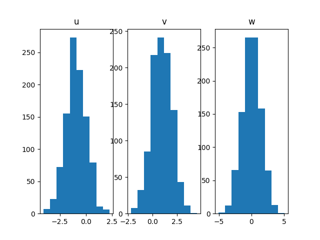

<!--
 DO NOT EDIT.
 THIS FILE WAS AUTOMATICALLY GENERATED BY mkdocs-gallery.
 TO MAKE CHANGES, EDIT THE SOURCE PYTHON FILE:
 "docs/scripts/examples/plot_uncertainty_propagation.py"
 LINE NUMBERS ARE GIVEN BELOW.
-->

!!! note

    Click [here](#download_links)
    to download the full example code


Uncertainty propagation
=======================

In this example,
we will propagate uncertainties through a discipline $f:u,v\mapsto u+v$

<!-- GENERATED FROM PYTHON SOURCE LINES 8-15 -->

```{.python }

from gemseo import create_discipline
from gemseo import create_parameter_space
from gemseo.uncertainty import create_statistics
from gemseo_mlearning.api import sample_discipline
from matplotlib import pyplot as plt

```


<!-- GENERATED FROM PYTHON SOURCE LINES 16-19 -->

Firstly,
we define a uncertain space with two normal random variables $u$ and $v$
with mean -1 and +1 and unit standard deviation.

<!-- GENERATED FROM PYTHON SOURCE LINES 19-23 -->

```{.python }
uncertain_space = create_parameter_space()
uncertain_space.add_random_variable("u", "OTNormalDistribution", mu=-1.0)
uncertain_space.add_random_variable("v", "OTNormalDistribution", mu=1.0)

```


<!-- GENERATED FROM PYTHON SOURCE LINES 24-26 -->

Then,
we define the discipline from analytic formula:

<!-- GENERATED FROM PYTHON SOURCE LINES 26-28 -->

```{.python }
discipline = create_discipline("AnalyticDiscipline", expressions={"w": "u+v"})

```


<!-- GENERATED FROM PYTHON SOURCE LINES 29-31 -->

Thirdly,
we sample the discipline with a Monte Carlo algorithm:

<!-- GENERATED FROM PYTHON SOURCE LINES 31-33 -->

```{.python }
dataset = sample_discipline(discipline, uncertain_space, ["w"], "OT_MONTE_CARLO", 1000)

```


Out:
{: .mkd-glr-script-out }

```{.shell .mkd-glr-script-out-disp }
/home/mickael/ModIA_5A/Metamodelisation/lh2pac/.venv/lib/python3.9/site-packages/pandas/core/frame.py:706: DeprecationWarning: Passing a BlockManager to IODataset is deprecated and will raise in a future version. Use public APIs instead.
  warnings.warn(

```


<!-- GENERATED FROM PYTHON SOURCE LINES 34-37 -->

Lastly,
we create an `EmpiricalStatistics` object to estimate statistics,
such as mean and variance:

<!-- GENERATED FROM PYTHON SOURCE LINES 37-44 -->

```{.python }
statistics = create_statistics(dataset)
mean = statistics.compute_mean()
variance = statistics.compute_variance()
names = ["u", "v", "w"]
for name in names:
    print(name, mean[name][0], variance[name][0])

```


Out:
{: .mkd-glr-script-out }

```{.shell .mkd-glr-script-out-disp }
/home/mickael/ModIA_5A/Metamodelisation/lh2pac/.venv/lib/python3.9/site-packages/pandas/core/frame.py:706: DeprecationWarning: Passing a BlockManager to IODataset is deprecated and will raise in a future version. Use public APIs instead.
  warnings.warn(
u -0.947776842011246 0.9405180678918997
v 0.9589697721518806 1.0263090423482364
w 0.011192930140634615 1.9698802472293142

```


<!-- GENERATED FROM PYTHON SOURCE LINES 45-50 -->

!!! note

    The mean and standard deviation of the output are almost equal to 0 and 2,
    which is the expected behavior
    of the sum of two independent Gaussian random variables.

<!-- GENERATED FROM PYTHON SOURCE LINES 52-53 -->

We can also plot the histogram of the three random variables:

<!-- GENERATED FROM PYTHON SOURCE LINES 53-58 -->

```{.python }
fig, axes = plt.subplots(1, 3)
for ax, name in zip(axes, names):
    ax.hist(dataset.get_view(variable_names=name))
    ax.set_title(name)
plt.show()
```


{: .mkd-glr-single-img srcset="../images/mkd_glr_plot_uncertainty_propagation_001.png"}

Out:
{: .mkd-glr-script-out }

```{.shell .mkd-glr-script-out-disp }
/home/mickael/ModIA_5A/Metamodelisation/lh2pac/.venv/lib/python3.9/site-packages/pandas/core/frame.py:706: DeprecationWarning: Passing a BlockManager to IODataset is deprecated and will raise in a future version. Use public APIs instead.
  warnings.warn(
/home/mickael/ModIA_5A/Metamodelisation/lh2pac/docs/scripts/examples/plot_uncertainty_propagation.py:57: UserWarning: FigureCanvasAgg is non-interactive, and thus cannot be shown
  plt.show()

```


**Total running time of the script:** ( 0 minutes  0.605 seconds)

<div id="download_links"></div>


[:fontawesome-solid-download: Download Python source code: plot_uncertainty_propagation.py](./plot_uncertainty_propagation.py){ .md-button .center}

[:fontawesome-solid-download: Download Jupyter notebook: plot_uncertainty_propagation.ipynb](./plot_uncertainty_propagation.ipynb){ .md-button .center}


[Gallery generated by mkdocs-gallery](https://mkdocs-gallery.github.io){: .mkd-glr-signature }
